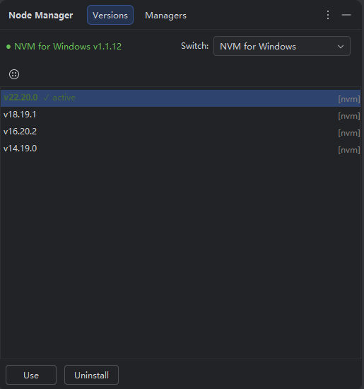
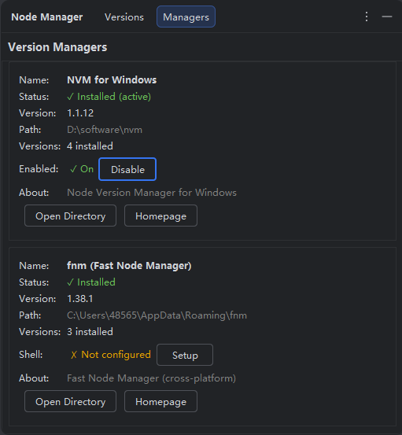

# Node Manager

> IntelliJ Platform 插件 —— 在 JetBrains IDE 中直接管理 Node.js 版本。

## 功能特性

- **版本管理** — 查看、安装、切换、卸载 Node.js 版本，无需离开 IDE
- **多管理器支持** — 同时支持 [nvm](https://github.com/nvm-sh/nvm)（Mac/Linux）、[nvm-windows](https://github.com/coreybutler/nvm-windows)（Windows）和 [fnm](https://github.com/Schniz/fnm)（自动检测）
- **管理器仪表盘** — 监控管理器状态、启用/禁用 nvm、配置 fnm Shell 集成
- **冲突检测** — 两个管理器同时控制 PATH 时自动提示警告
- **状态栏组件** — 随时查看当前活跃的 Node.js 版本
- **搜索过滤** — 从完整的 Node.js 发行列表中快速查找版本
- **镜像源支持** — 可配置国内镜像源（如 npmmirror），加速下载

## 环境要求

- IntelliJ Platform IDE 2024.2+
- 至少安装以下一个版本管理器：
  - [nvm](https://github.com/nvm-sh/nvm)（Mac / Linux）
  - [nvm-windows](https://github.com/coreybutler/nvm-windows)（Windows）
  - [fnm](https://github.com/Schniz/fnm)（跨平台）

## 安装方式

1. 打开 **Settings → Plugins → Marketplace**
2. 搜索 **Node Manager**
3. 点击 **Install**，重启 IDE 即可

## 使用说明

### Versions 页面

- 查看所有已安装的 Node.js 版本
- 点击 **⊕** 安装新版本（支持搜索过滤）
- 右键版本可 **切换** 或 **卸载**
- 使用顶部 **Switch** 下拉框选择使用哪个管理器

### Managers 页面

- 查看已安装管理器的状态信息
- **nvm**：提供 Enable/Disable 开关（`nvm on`/`nvm off`）
- **fnm**：提供 Shell 集成的 Setup/Remove（PowerShell Profile 配置）
- 两个管理器同时活跃时显示冲突警告

## 第三方工具声明

本插件 **不捆绑、不包含、不分发** 任何第三方软件。
仅与用户系统上已安装的版本管理器进行交互：

| 工具 | 许可证 | 仓库地址 |
| ---- | ------ | -------- |
| [nvm](https://github.com/nvm-sh/nvm) | MIT | github.com/nvm-sh/nvm |
| [nvm-windows](https://github.com/coreybutler/nvm-windows) | MIT | github.com/coreybutler/nvm-windows |
| [fnm](https://github.com/Schniz/fnm) | GPL-3.0 | github.com/Schniz/fnm |
| [Node.js](https://nodejs.org) | MIT | nodejs.org |

所有商标和产品名称均为其各自所有者的财产。
"Node.js" 是 OpenJS Foundation 的商标。

## 隐私说明

本插件：

- **不收集** 任何用户数据或遥测信息
- **不发送** 任何信息到外部服务器（唯一的网络请求是从 `nodejs.org/dist/index.json` 或配置的镜像源获取公开的版本列表）
- 所有版本管理操作均通过已安装的工具在 **本地** 完成

## 开源协议

MIT License — 详见 [LICENSE](LICENSE)
